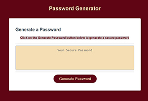

## Project Name: Password Generator
  

## Links to deployed application and repository:
* [Deployed Application](https://sskumar4.github.io/RandomPasswordGen)
* [Repository](https://github.com/sskumar4/RandomPasswordGen)

## Introduction:   
An application that generates a random password with greater security based on user-selected criteria. The app will run in the browser and feature dynamically updated HTML and CSS powered by the JavaScript code. It will also feature a clean and polished user interface that adapts to multiple screen sizes.

## Technologies: 
HTML, CSS, JavaScript

## Features
Used semantic html
## Files: 
  * index.html, script.js and style.css
## Developed the app with the following features:
  * The user is presented with a series of prompts for password criteria when the button to generate a password is clicked
  * prompt for the length of at least 8-128 characters
  * prompt to select lowercase, uppercase, numeric, and/or special characters
  * validate and check if the user selected atleast one character type from the criteria
  * generate password with all the criteria and display in the text area
  
Checked script.js code using javascript validator

## Launch

Launch [Deployed Application](https://sskumar4.github.io/RandomPasswordGen) To genearate password, click the Generate Password button and answer all password criteria. 

